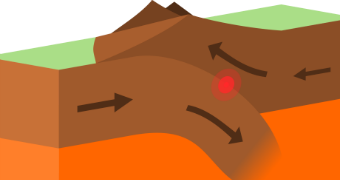
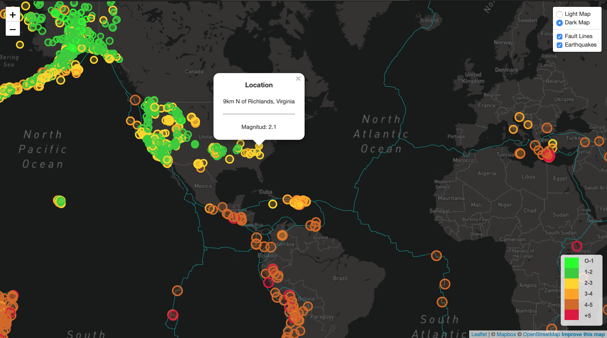

# Leaflet-Challenge

## Introduction

This project was done to give a bigger view of the earthquakes around the world between 2020-May-01 and 2020-May-15
The map show the tectonic plates and the earthquakes giving details of each one like the location and the magnitud, also each point have a color providing us a color depending of the magnitud of the earthquake:

The ranges of magnitudes are:
- 0 - 1
- 1 - 2
- 2 - 3
- 3 - 4
- 4 - 5
- +5

Also you can change the layer color of the map choosing between Light or Dark Map; another feature is that you can activate or deactivate the tectonic lines and the citcles that contains the location and magnitude data.

The map can be consulted here -> [Earthquakes map](https://enr1que319-earthquakes.herokuapp.com "Earthquakes")

### Tools

The following tools were used to do the analysis

- HTML5
- CSS
- JavaScript
- Leaflet

The platform used to mount the web page is Heroku

## Data

The information used was provided by USGS web page and it is in geojson format, you can see the dta structure below.

#### Data Structure

    [ 
      {
        "type": "FeatureCollection",
        "features": [
                      {
                        "type": "Feature",
                        "properties": {
                        "LAYER": "plate boundary",
                        "Name": "AF-AN",
                        "Source": "Mueller et al. [1987]",
                        "PlateA": "AF",
                        "PlateB": "AN",
                        "Type": ""
                        },
                        "geometry": {
                        "type": "LineString",
                        "coordinates": [
                                        [-0.4379, -54.8518],
                                        [-0.038826, -54.6772],
                                        [0.443182, -54.4512],
                                        [0.964534, -54.8322],
                                        [1.69481, -54.399],
                                        [2.35975, -54.0374],
                                        [3.02542, -53.6507],
                                        [3.36894, -53.8341],
                                        [3.95638, -54.1267],
                                        [4.41458, -54.4303],
                                        [4.82661, -54.1616],
                                        [5.08372, -54.3093],
                                        [5.49469, -54.5429],
                                        [6.18373, -54.1145],
                                        [6.6254, -53.8142],
                                        [7.23729, -54.1012],
                                        [7.77235, -54.396]
                                       ]
                                    }
                      }
                    ]
      }
    ]
